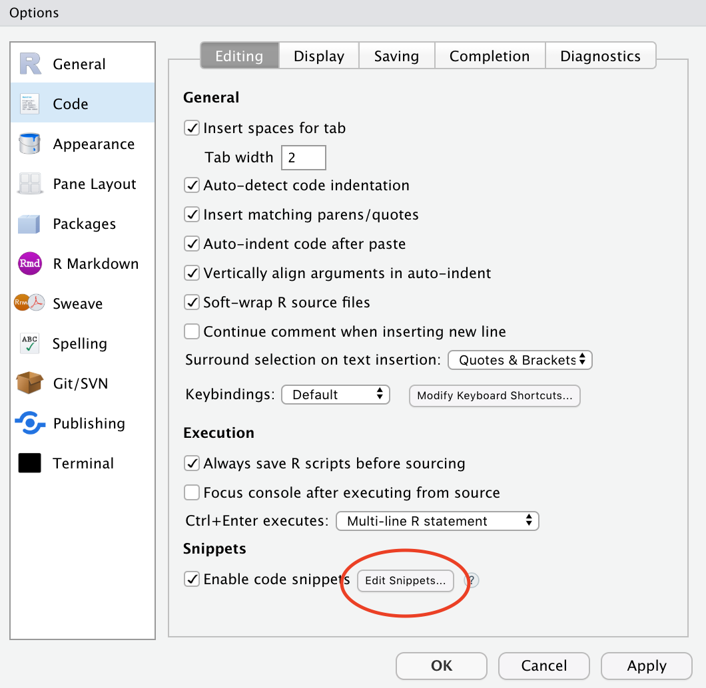
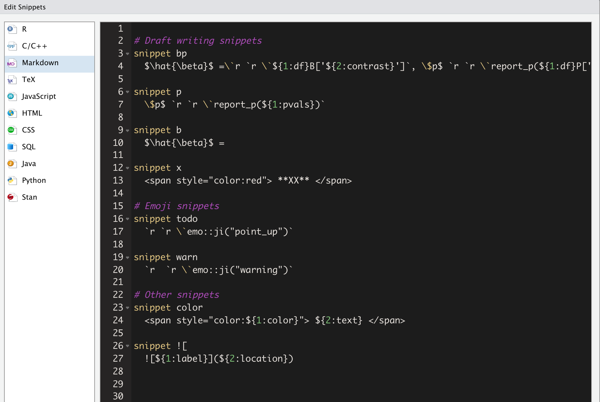

# Nitty gritty stuff
`r emo::ji("warning")` Not everything here is a fully formed thought!

## Reference management
There are lots of great tools for reference management. Some of the most popular ones amongst my colleagues are: 

- [Mendeley](https://www.mendeley.com/?interaction_required=true)
- [Zotero](https://www.zotero.org/)

I really like: 

- [JabRef](http://www.jabref.org/). It is a lot less fancy than Mendeley and Zotero though. 
- [BibDesk](https://bibdesk.sourceforge.io/) (for Mac users) is very similar, though after a brief trial stint I found I prefer the layout of JabRef. You could also edit your .bib file by hand in a regular text editor if you'd like, so long as you stick to the conventions.


Ultimately, it comes down to what works for you.

Importantly, for use with R Markdown, what you need is a [`.bib` file](https://rmarkdown.rstudio.com/authoring_bibliographies_and_citations.html). You specify the path to this file in your main YAML (in `index.Rmd`).

**My process:**

- When I come across a new paper, I immediately add its info to my .bib file. I also immediately add important keywords or notes to the bib entry. 
- I get the BibTeX info using Google Scholar's citation tools (specifically, the [GoogleScholar Chrome plugin](https://chrome.google.com/webstore/detail/google-scholar-button/ldipcbpaocekfooobnbcddclnhejkcpn?hl=en))
- I also immediately make any quick edits I may need to the entry fields (e.g., words that need to be capitalized must be encased in `{}`; sometimes Google Scholar's single quotes have given me grief, so I usually replace these... etc)
- I have a category called "read me!" that I dump all my new papers into to remind myself what I added recently and why.

#### Citation keys {-}

When you cite references from your .bib file, you need to reference the *citation key*. In the following standard bib entry example, the citation key is the first argument (kalf2012). I try to be super consistent with my naming conventions (e.g., always in the form of firstAuthorYear, plus an additional keyword when necessary). This makes it easier to call to mind references from memory. To cite a source, preface it with `@`, and use square brackets `[]` to enclose it in parentheses, like this `[@kalf2012]`. Multiple sources can be separated by commas.

```
@article{kalf2012,
  title={Prevalence of oropharyngeal dysphagia in {P}arkinson’s disease: a meta-analysis},
  author={Kalf, JG and De Swart, BJM and Bloem, BR and Munneke, Marten},
  journal={Parkinsonism \& related disorders},
  volume={18},
  number={4},
  pages={311--315},
  year={2012},
  publisher={Elsevier}
}
```

You can specify how you would like your bibliography and citations to be formatted by pointing to `.csl` style files or via the `biblio-style` argument as we have done in our YAML in this tutorial.

#### Citr {-}
A very useful **RStudio Add-in** that allows you to cite your sources from a drop-down menu is [citr](https://github.com/crsh/citr).

A list of references will be autogenerated at the end of your document in rmarkdown/bookdown.

#### Citing R packages {-}
The `bookdown` manual details how to use the [`write_bib()`](https://bookdown.org/yihui/bookdown/citations.html) helper function to generate BibTeX entries automatically for R Packages. 

### More resources {-}
- [bookdown chapter on citations](https://bookdown.org/yihui/bookdown/citations.html)
- [Zotero hacks for rmarkdown](https://ikashnitsky.github.io/2019/zotero/)

## Notes to self within text
I pepper my text with "XX" and "TODO" markers to flag all areas I know I will need to come back and pay special attention to. This makes it easy to search each chapter. I also make them [red](https://stackoverflow.com/questions/29067541/how-to-change-the-font-color) so I can more easily see them in my preview versions (but so far have only figured out how to do this for HTML syntax...)

## Snippets! 
I. `r emo::ji("two_hearts")`. SNIPPETS. You can predefine snippets, or text shortcuts, to insert common strings of text. I have snippets for everything from inserting warning emoji to myself (`r emo::ji("warning")`) to inserting text + R code for reporting regression model results.

To customize your snippets from RStudio, go to : `Tools/Global Options...` and then `Code` and `Edit Snippets`:



Here are some of my snippets. I organize them into themes to make it easier to edit and add to them:



### More resources
- [Mara Averick's guide](https://maraaverick.rbind.io/2017/09/custom-snippets-in-rstudio-faster-tweet-chunks-for-all/)
- [RStudio Support guide](https://support.rstudio.com/hc/en-us/articles/204463668-Code-Snippets)
- [My tweet rant on getting snippets to work for inline R code](https://twitter.com/theaknowles/status/1108479305556869120)

## Predefined functions
If you find yourself writing the same code over and over, consider turning it into a [function](https://swcarpentry.github.io/r-novice-inflammation/02-func-R/).

### Where to keep your functions

- Option 1. Store them in an .R file (e.g., `my_functions.R`) and *source* this file as needed.
- Option 2. [Create an R package](https://hilaryparker.com/2014/04/29/writing-an-r-package-from-scratch/) (not as hard as it sounds!) and load it along with your other packages.
  - TJ Mahr has a [nice example](https://github.com/tjmahr/tjmisc) of a "misc" package for this purpose.
  - [academicWriteR](https://github.com/jvcasillas/academicWriteR) is also a great resource for the kinds of functions you may want to use.

## Autogenerating table/figure numbers
As long as you follow the instructions in this tutorial, your tables (via `kable`) will be autonumbered and will show up in your List of Tables defined in `doc_preface.tex`. Your figures (via the caption option in the R chunk) will also be autonumbered and will show up in your List of Figures.

**Caveat**: I have tried to figure out happier ways to make tables in R Markdown work for me across Word/PDF outputs and I have not found one single solution I'm 100% happy with. Some rambling thoughts (see also Section \@ref(limitations)): 

- `kable` is necessary to be automatically added to your List of Tables, but it has fewer output options for .docx. 
- `flextable` is a great package if you are only outputting to Word or HTML, but not to PDF
- `kableExtra` has an function `to_image()` that will make nicely formatted HTML/PDF tables show up as an image across different outputs, but it does not play nice with autogenerated numbering
- `captioner` is a great solution for dealing with autogeneration of numbers and figures without dealing with `kable`, but doesn't show up in the List of Tables
- Some people have [suggested](https://twitter.com/tjmahr/status/1112137016077152256) using if-statements to toggle whether you're knitting to HTML or PDF, but I have found this too cumbersome for my long-term happiness.

## Version control

[Git](https://guides.github.com/activities/hello-world/) is Great. I personally found the language surrounding Git and GitHub to be a steep learning curve, but Jenny Bryan recently published [Happy Git with R](https://happygitwithr.com/) that makes the whole process a lot more accessible.

I also use [GitHub Desktop](https://desktop.github.com/) because I was becoming frustrated at my continued forgetting of command line syntax for using git and not lighting everything on fire.

### Other resources {-}
- [Jenny Bryan's Happy Git with R](https://happygitwithr.com/)
- Pauline Barmby curated some resources for her R-Ladies #LdnOnt presentation on Git and GitHub:
  - [Tutorial 1: HubSpot Intro](https://product.hubspot.com/blog/git-and-github-tutorial-for-beginners)
  - [Tutorial 2: Software Carpentry Intro](http://swcarpentry.github.io/git-novice/)
  - [Tutorial 3: Atlassian Tutorial](https://www.atlassian.com/git/tutorials)
- [GitHub Guide](https://guides.github.com/activities/hello-world/)


