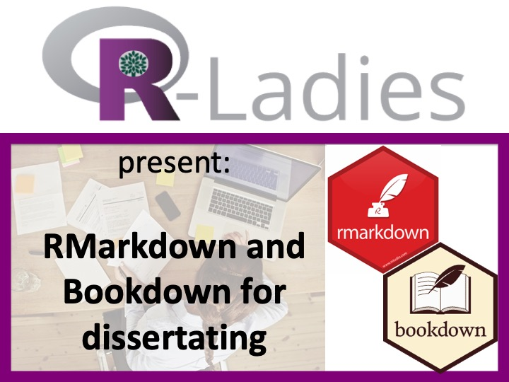

--- 
bibliography: references.bib
site: bookdown::bookdown_site
output: bookdown::gitbook
documentclass: book
fontsize: 12pt
subparagraph: yes
link-citations: no
biblio-style: apalike
always_allow_html: yes
---
```{r setup-index, include=FALSE}
knitr::opts_chunk$set(echo = FALSE, message = FALSE, warning = FALSE)
options(digits = 3)
```

# Dissertating with RMarkdown and Bookdown {-}


<center>

***A preliminary tutorial led by Thea Knowles for the R-Ladies #LdnOnt workshop series***

***Last updated:** `r Sys.Date()`*


</center>

