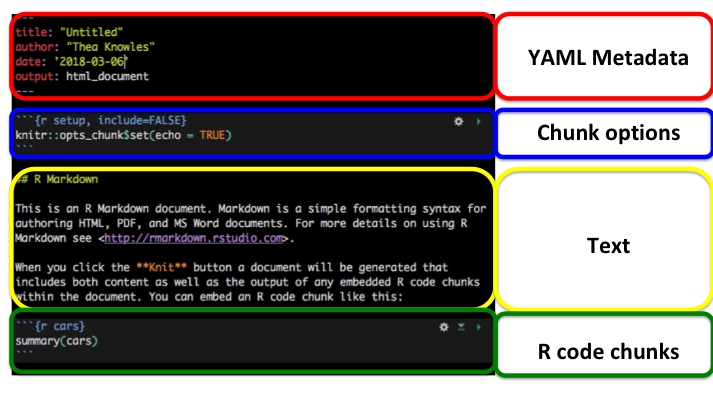
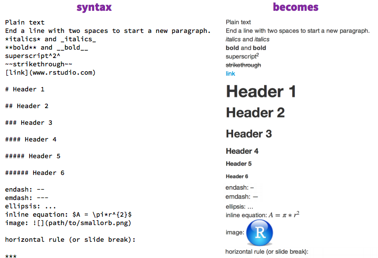
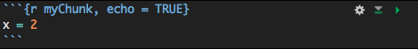
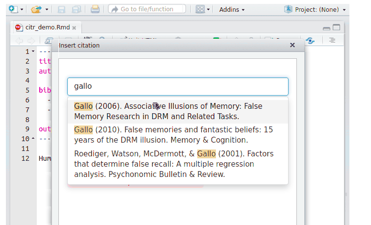
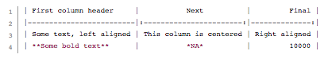

```{r setup, include=FALSE}
knitr::opts_chunk$set(echo = TRUE)
library(emo)
```

# Academic writing with R Markdown and Bookdown

## Agenda
1. The tools we'll be using
2. Getting set up
3. Writing a summary report
4. Writing a manuscript
5. Writing a thesis

# 1. Tools

## Why R Markdown?
<div class="columns-2">


- Integrate R code directly into writing using basic Markdown syntax
- Reference management integration
- Reproducibility
- Accessible learning curve

</div>

https://rmarkdown.rstudio.com/


## Why `bookdown`?

<div class="columns-2">


- Integrate multiple R Markdown documents into a larger project
- Keep chapters separate

</div>

https://bookdown.org/yihui/bookdown/


## Knitting with `knitr`
<div class="columns-2">

<!--  -->

When you run R Markdown, you are **knitting** together plain Markdown text and R code.

`knitr` is the *engine*.
</div>

## Materials for today
We will generate the following files:

  - Helper R script  (helper.R)
  - Summary report (starwars_summary.Rmd)
  - Manuscript (starwars_manuscript.Rmd)
  - Thesis (starwars_thesis.Rmd)
  
We will also use the following files

- custom_reference.docx
- apa.csl
- starwars_refs.bib


# 2. Getting set up


## Setting up: Software

- [R](https://www.r-project.org/)
- [RStudio](https://www.rstudio.com/products/rstudio/download/)
  - Recent versions of RStudio also include [Pandoc](https://pandoc.org/), which is required to compile documents
- Latex for [Mac](https://tug.org/mactex/mactex-download.html) or [Windows](https://miktex.org/download) (if you want to compile to PDF).
  - Alternatively, install [TinyTex](https://yihui.name/tinytex/), the Latex distribution created and recommended by Yihui Xie, creator of RMarkdown and bookdown[^139][^1032].

----

## Setting up: R packages 

- [`bookdown` R package](https://github.com/rstudio/bookdown). 
- Installing `bookdown` will automatically import `knitr` and `rmarkdown` pacakges as well. Install it by entering the following code into your R console:
- Not necessary, but awfully helpful for data analysis in R in general, is the [`tidyverse` R package](https://www.tidyverse.org/)

```{r eval=FALSE, echo=TRUE}
install.packages(c("bookdown", "tidyverse"))
# includes rmarkdown, knitr
```

## Setting up: Git & GitHub
- We won't go over this in today's presentation, but [git](https://git-scm.com/downloads) is a very handy version control system that helps you back up your projects, and has easy integration with RStudio. 
- **Recommended reading:** [Happy Git with R](https://happygitwithr.com/index.html)


## Setting up: Recommended workflow for a new project

1. Create a new R Project for your research project
2. Include subdirectories for R scripts, documents (reports, manuscripts)
3. Do your data analysis in raw R scripts
<!-- - If you don't have too many steps, you could use one .R script -->
<!--   - `helper.R` -->
<!-- - I sometimes break this down into separate .R scripts -->
<!--   - `1_tidy.R`, `2_models.R` -->
4. Refer to your tidied data/results using inline R code and R chunks in your R Markdown documents
  
Note: Workflow for a thesis is a slightly different beast.

# R Markdown document components

## <span style="color:red"> YAML </span>
[YAML](https://en.wikipedia.org/wiki/YAML) (rhymes with camel): The header that tells R Markdown how to generate your document. Indentation and spacing are very important.

- Permits the following to happen when you knit: 
     - .Rmd -> knitr -> .md -> Pandoc -> output
     - Output can be .docx, .html, .pdf, and many others
- YAML: "YAML Ain't Markup Language"

**Basic: **

```
title: "Untitled"
author: "Thea Knowles"
date: '2018-02-18'
output: word_document
```

## <span style="color:red"> YAML </span>

**Gettin' fancy**

```
title: "A very important title"
subtitle: "A less important subtitle"
author:
- Thea Knowles^1^, Thea Knowles' Alter Ego^2^
- ^1^Western University, ^2^University of Western Ontario
date: "`r format(Sys.time(), '%d %B, %Y')`"
output:
  bookdown::word_document2:
    fig_caption: yes
    md_extensions: +footnotes
    reference_docx: custom_reference.docx
    toc: yes
date: "Last updated: ` r format(Sys.time(), '%d %B, %Y')`"
```

## <span style="color:red"> YAML </span>
<div class="columns-2">
**Even fancier:**

- output extensions
- template
- bibliography file
- csl (references style guide)
- css (supreme customization!)

**Different options for:**

- [HTML output](https://rmarkdown.rstudio.com/html_document_format.html)
- [Word output](https://rmarkdown.rstudio.com/word_document_format.html)
- [PDF output](https://rmarkdown.rstudio.com/pdf_document_format.html)
</div>

## Essential parts of any R Markdown document


## <span style="color:blue"> Chunk options </span>
- [*Chunks*](http://yihui.name/knitr/options/) are sections that will include R code. By setting defaults at the beginning of your document, you can specify what you want most of your chunks to do.
- In each chunk, you can specify options in the form `tag=value` in the chunk header.
     - For example, in the following, the tag `include` is set to `FALSE`, indicating that we don't want the contents of this chunk included in the output

This is the default chunk options set when you create a new .RMD (R Markdown) file.

````
```{r setup, include=FALSE}`r ''`
knitr::opts_chunk$set(echo = TRUE)
```
````

## <span style="color:blue"> Chunk options </span>

````
```{r setup, include=FALSE}`r ''`
knitr::opts_chunk$set(echo = TRUE)
```
````

This chunk provides the following information for "knitting" the document:

- `setup`: the name of the chunk You shouldn't have two chunks with the same name, unless they are unnamed (in which case they just get numbered automatically during the knit process)
- `include = false`: the chunk will not be included in the output after knitting.
- `knitr::opts_chunk$set(echo = TRUE)`: the default behavior for chunks is to "echo;" you will see the actual code printed in the final output. You can set this to false if you don't want the actual code included by default.

## <span style="color:blue"> Chunk options </span>
- You don't have to change this unless you want to
- You can assign different values on a chunk-by-chunk basis
- More on this in a minute!


## Essential parts of any R Markdown document


## <span style="color:gold"> Text </span>
*The briefest ever intro to Markdown syntax*

- [R Markdown Cheat Sheet](https://www.rstudio.com/wp-content/uploads/2016/03/rmarkdown-cheatsheet-2.0.pdf)
- [R Markdown Reference Guide](https://www.rstudio.com/wp-content/uploads/2016/03/rmarkdown-cheatsheet-2.0.pdf)




## Essential parts of any R Markdown document


## <span style="color:green"> R Code chunks </span>



- Insert chunks: CMD + k or click `Code >> Insert chunk`
- name your chunk (`myChunk`)
- specify options (`echo=TRUE`)

Some other <span style="color:green"> chunk options </span>:

- `echo = FALSE`: don't show the code itself in the final document
- `include = FALSE`: don't include this code or its output in the final document
- `eval = FALSE`: don't actually run this code at all
- [And more...](https://yihui.name/knitr/options/)


# 3. Writing a summary report

## Recipe for R Markdown summary report | My suggestion

|         Ingredient        |          In this example         |
|:-------------------------:|:--------------------------------:|
|            **data**           | dplyr:: starwars                 |
|       helper script       | helper.R                         |
| R Markdown summary document | starwars_summary_report.Rmd    |

## 1. Data
We will use the `starwars` dataset included in the `dplyr` package. 

If you want a refresher of how to read in your own data, check out 
:
- [Check out Pierina's R-Ladies materials for a refresher](https://www.meetup.com/rladies-ldnont/messages/boards/thread/51164998)

## Starwars
```{r message=FALSE}
library(dplyr)
starwars %>% head()
```

## Recipe for R Markdown summary document | My suggestion

|         Ingredient        |          In this example         |
|:-------------------------:|:--------------------------------:|
|            data           | dplyr:: starwars                 |
|       ***helper script***       | helper.R                         |
| R Markdown summary document | starwars_summary_report.Rmd    |


## 2. Helper script
`helper.R`

- Use a helper .R script to do your data cleaning and basic analyses
- Straight up R code. No markdown.
- You can pull this .R document into future .Rmd documents using `source()`
- The benefit of using a helper script is that you can keep your analyses consistant. Whether you're writing an informal summary report to share with your supervisor or a full manuscript, you don't have to copy and paste the analyses each time you do something new. 

## Note: Other options for code helpers

***helper.RData***: If your helper script takes a long time to run, you may instead find it useful to save its output to an .RData file:

```{r echo=TRUE, eval=FALSE}
save("helper.RData")
```


You can then load this .Rdata into your later reports instead of the raw .R script.
You source an .R file:

```{r echo=TRUE, eval=FALSE}
source("helper.R")
```

You load an .Rdata file:

```{r echo=TRUE, eval=FALSE}
load("helper.RData")
```


## Note: Other options for code helpers

***Modular .R scripts***: For bigger projects, I often break my R scripts down into smaller scripts, e.g., 

- `1_tidy.R, 2_models.R, 3_plots.R`

In my workflows, each of these sources the last. I.e., the first line of `2_models.R` is 

```{r eval=FALSE}
source("1_tidy.R")
```

And in my R Markdown file, I source the highest level or a final .RData file.


## Recipe for R Markdown summary document | My suggestion

|         Ingredient        |          In this example         |
|:-------------------------:|:--------------------------------:|
|            data           | dplyr:: starwars                 |
|       helper script       | helper.R                         |
| ***R Markdown summary document*** | starwars_summary_report.Rmd    |

## 3. R Markdown document
- `starwars_summary_report.Rmd`

### Recall: R Markdown documents...
- End in extension `.Rmd`
- Incorporate both R code (in chunks) and plain text (in Markdown)
- Require YAML at the beginning


# Let's get started!

## Hold up! Let's check in
**Packages**: Do you have all the packages installed?

```{r eval=FALSE}
install.packages(c("rmarkdown", "bookdown", "tidyverse"))
```


**Directory structure**: The following files should all be in the same directory:

- `apa.csl`
- `custom_reference.docx`
- `helper.R`
- `rmd-bkdn.Rproj`
- `starwars_refs.bib`

## Open helper.R

*Review as group*

## EXERCISE 1

- Create a new R Markdown file and save it in a subdirectory called "reports"
- Delete everything below the YAML
- Insert:

1. A chunk that sources `helper.R`
2. Another chunk that calls the `sw_summary_human` data frame
3. A line of text with inline R code, for example, calling the average mass of all species

- Then Knit to HTML (Knit button OR CMD + K)


## EXERCISE 1: ANSWERS

1\. A chunk that sources `helper.R`:

````markdown
`r ''````{r source-helper}
source("../helper.R")
```
````

2\. Another chunk that calls the `sw_summary_human` data frame
````markdown
`r ''````{r summary-df}
sw_summary_human
```
````

3\. A line of text containing inline R code, e.g:

> This average weight of all species is \`\r mean(starwars$mass, na.rm=TRUE)`


## EXERCISE 2

- Break `helper.R` into 2 smaller scripts: `1_tidy.R` and `2_models.R`. 
- Save these new scripts in a subdirectory called "r_scripts"
- Run both scripts, save an .RData file
- In your .Rmd file, comment out your `source()` line and replace it with `load()`, calling your new .RData file in. 
- Knit again

Is everything the same?


# 4. Writing a manuscript

----

### Recap of recipe for a R Markdown summary report:
|         Ingredient        |          In this example         |
|:-------------------------:|:--------------------------------:|
|            data           | starwars                         |
|       helper script       | helper.R                         |
| R Markdown summary document | summary_report.Rmd             |


----

### Recipe for R Markdown .docx manuscript

|         Ingredient        |          In this example         |
|:-------------------------:|:--------------------------------:|
|            data           | starwars                         |
|       helper(s)           | helper.R, starwars.RData, etc... |
| R Markdown document(s)    | manuscript.Rmd                   |
| **style reference .docx file** (specify styles in your Word doc)| custom_reference.docx|
| **references in .bib format** | starwars_refs.bib           |
| **style bibliography (csl) file** (how your bibliography will be formatted) | apa.csl |


## Recipe for R Markdown manuscript: Caveat!
- This is one (my) way of doing it
- There are many other ways!
- See resources at end of this presentation for inspiration!

## Recipe for R Markdown manuscript: Caveat!
- While you *can* be really specific in your formatting, we won't get into a *ton* of detail here.
- Since many journals often do a lot of the formatting from their end, what authors actually need to submit may be fairly bare-bones (sometimes)
- If you're submitting a .docx file for publication, you can also make your final tweaks in the actual Word document itself, rather than in R Markdown
     - Save this until the end, because whatever you do in the Word document itself will be rewritten when you knit in R Markdown.


## manuscript.Rmd
We will start with the main body file

- Open manuscript.Rmd
- Knit it!
- Examine it `r emo::ji("magnifying_glass_tilted_left")`


## Manuscript: YAML
We can make use of many more options!

Notice I've used outputs from the `bookdown` package here. Bookdown gives us way more functionality (an important one: cross-referencing figures and tables).


## YAML: custom_reference.docx

```{r eval=FALSE}

output:
  bookdown::word_document2:
    fig_caption: yes
    md_extensions: +footnotes
    reference_docx: ../custom_reference.docx
    toc: yes
```


- Allows you to set the styles for your .docx output in Microsoft Word directly
- Contents of the .docx file are IGNORED
- Styles and properties (margins, headers text, etc) are used in .Rmd's .docx output
- For easiest use, include the custom_reference.docx in the same directory as the rest of your RProject

## YAML: Bibliography

```{r eval=FALSE}
bibliography: ../starwars_refs.bib
```


References must be in [BibLaTex (.bib) format](https://www.latex-tutorial.com/tutorials/bibtex/#bib-file)

- Most reference managers can easily convert to .bib
     - [Converting from Mendeley to .bib](https://blog.mendeley.com/2012/03/24/how-to-series-generate-bibtex-files-for-your-collections-for-use-in-latex-part-3-of-12/)
- Use *keys* to cite a work in the markdown text, which will look like this in your markdown text:

     > *"It is well known that some things are facts, and others are not [@knowles2018]."*

## Bibliography: `citr`

- A very useful RStudio Add-in that allows you to cite your sources from a drop-down menu: [citr](https://github.com/crsh/citr)



## Bibliography info: Caveat! 
Thea's preferences here, full disclosure:

- I use one "master" references.bib file for all my projects
- This file stays in one location, and I include the path to it in the YAML: `bibliography: /Users/thea/references.bib`
- My "keys" all have the same format in order to make it easy to remember: firstauthorYEAR (knowles2018)
     - additional keyword if multiples (knowles2018dbs)
     
## Bibliography info: Caveat! 
Thea's preferences here, full disclosure:

- When I come across a new paper, I immediately add its info to my .bib file
- I get the bibtex info using Google Scholar's citation tools (specifically, the [GoogleScholar Chrome plugin](https://chrome.google.com/webstore/detail/google-scholar-button/ldipcbpaocekfooobnbcddclnhejkcpn?hl=en))
- I use [JabRef](https://sourceforge.net/projects/jabref/) to manage my .bib file because I find it more user friendly, but you could also edit the .bib file in any text editor (just be cautious of formatting!)

## YAML: CSL file: apa.csl 

**CSL**: Citation Style Language

```{r eval=FALSE}
csl: ../apa.csl
```


- Specifies how you want citations and bibliography formatted
- Downloadable from many sources
     - **One good source**: [Zotero style repository](https://www.zotero.org/styles)
- .csl files I use often:
     - `apa.csl`
     - `biomed-central.csl `
          - when I need numeric in-text citations
     - `chicago-annotated-bibliography.csl`
          - when I'm writing annotated bibliographies


## Writing the manuscript

- Write just as you did for the summary document: 
     - Markdown-styled text, and R chunks sprinkled throughout!
- Separate writing tasks: "story writing" versus "results reporting"


# Inserting figures and tables | Not data-related!

## Inserting figures and tables
- You can insert tables and figures in R chunks, as we did in the summary document
- You can also insert them as non-R elements that wouldn't be accessible from the data
     - e.g., Participant demographics
     
## Inserting tables in Markdown | i.e., not R code
- Markdown tables have a pretty straightforward syntax: 



- Nevertheless, I often forget it. This site is handy:
     - [Table generator](http://www.tablesgenerator.com/markdown_tables)


## Inserting images in Markdown | i.e., not R code

Several ways to do this! Here's one:

- Have a subdirectory called `images`; store your non-data-related images here

````markdown
`r ''````{r sw-logo, fig.cap = "Starwars logo", echo=FALSE}
knitr::include_graphics("../images/starwars.png")
```
````

# Inserting tables and figures with R code


## Inserting figures in R chunks
- Just like in the summary document, but we can add more options to the chunk

````markdown
`r ''````{r fig-sw, fig.cap = "Mass by Height for all species", 
echo = FALSE, fig.align='center'}
sw_plot
```
````

- We will refer to the figure by its chunk label `fig-sw`
- The caption will be specified by `fig.cap`

## Inserting tables in R chunks

Use `knitr::kable()`

````markdown
`r ''````{r tab-sw-human, results='asis', echo = FALSE}
knitr::kable((sw_summary_human), 
             booktabs=T, 
             caption="Average height and mass for humans vs. non-humans")
```
````

- `knitr::kable()` will allow you to cross-reference easily later, but is not the only way.
- Table options specified as an argument to `kable()`, not as a chunk option
- Consider also using [`flextable()`](https://davidgohel.github.io/flextable/) with the [`captioner`](https://cran.r-project.org/web/packages/captioner/vignettes/using_captioner.html) package as well.


## Embedding figures/tables in R chunks

**Caution**: 

- Not all chunk options are available for all outputs:

> Chunk options fig.align, out.width, out.height, out.extra are not supported for docx output

- Notice cross-referencing tables worked for the `knitr::kable()` option, but out markdown table above did not get automatically numbered. If you want to include both R and non-R tables, I'd suggest either 1) converting markdown tables to R code or 2) using the `flextable` package to generate captions and cross-references.

## Cross-referencing figures using `bookdown`
In the YAML, rather than specify outputs like `word_document` or `html_document`, we will now use the [`bookdown` versions of these](https://bookdown.org/yihui/bookdown/a-single-document.html):
- e.g., `bookdown::html_document2`, `bookdown::word_document2`
- This will allow us to automatically refer to Figures/Tables without having to explicitly refer to them by number
     - This is helpful if you wind up moving things around in your manuscript.

## Cross-referencing figures
Syntax for cross-referencing with `bookdown::word_document2` output requires you:

- Refer to the environment (e.g., fig vs. tab)
- Refer to the chunk label containing the figure or table

> See Figure \@ref(fig:fig-sw) below.
> See Table \@ref(tab:tab-sw-human).

https://bookdown.org/yihui/bookdown/figures.html#figures


## More to learn
- [`redoc`](https://github.com/noamross/redoc): A new package for enabling 2-way Rmarkdown and Microsoft Word workflow
- [Grammar](https://github.com/ropenscilabs/gramr) and [spelling](https://github.com/ropensci/spelling#readme) in R Markdown
- Make your life easier while writing by using:
  - [snippets](https://notes.peter-baumgartner.net/2019/06/12/rstudio-snippets-for-markdown/)
  - [`remedy` RStudio addin](https://thinkr-open.github.io/remedy/) for mapping keyboard shortcuts to writing helpers.
- APA manuscript templates for R Markdown using [Papaja](https://crsh.github.io/papaja_man/introduction.html)


## More to learn
- It's okay to Google. Lots.
- It's okay to be hacky at times to *just do the thing*
     - Efficiency and elegance come with time
          - Well, sometimes the elegance lags behind


## Awesome resources of using R Markdown for academic writing

- [Page Piccinini's R for Publication Lessons](https://datascienceplus.com/r-for-publication-by-page-piccinini-lesson-1-r-basics/)
     - Also contains GREAT explanations of regression analyses

- [Rosanna Van Hespen's guide to writing your thesis with R Markdown](https://rosannavanhespenresearch.wordpress.com/2016/02/03/writing-your-thesis-with-r-markdown-1-getting-started/)

- [A list of other very helpful resources](https://www.one-tab.com/page/d00HO6mxTTuqo2o7aGCffQ)

## Next: Using `bookdown` to compile multiple R Markdown documents
[Tutorial](https://bookdown.org/thea_knowles/dissertating_rmd_presentation/)


