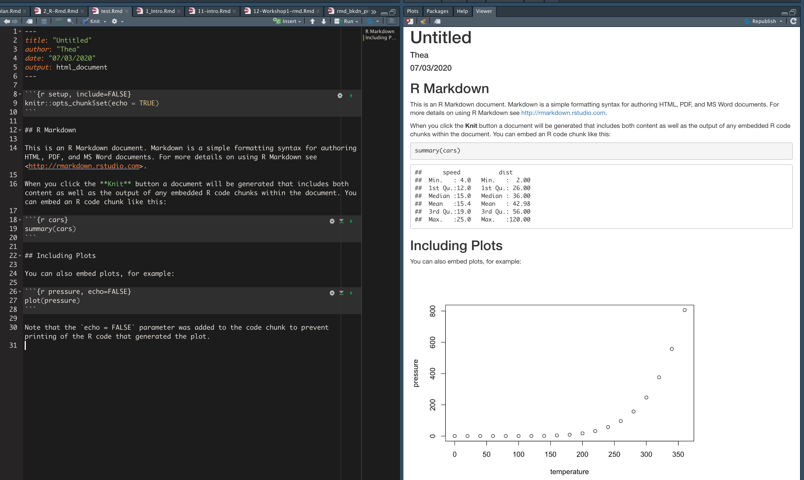
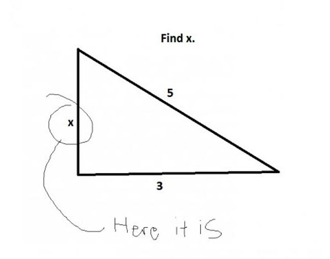
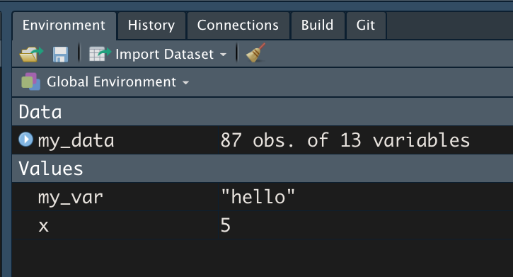
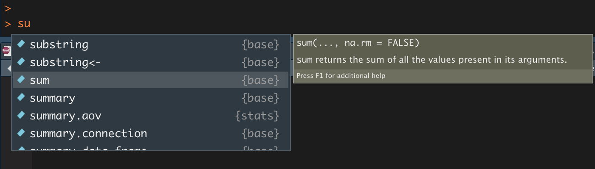
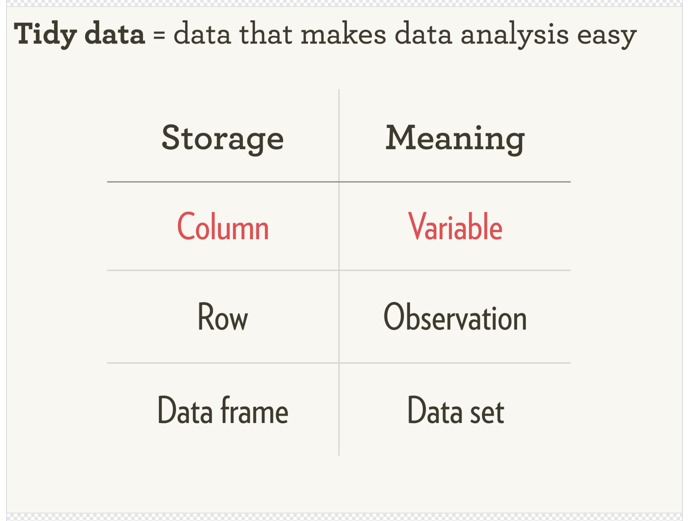
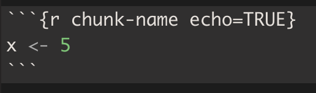
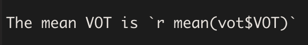
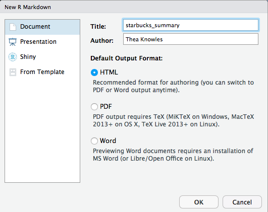
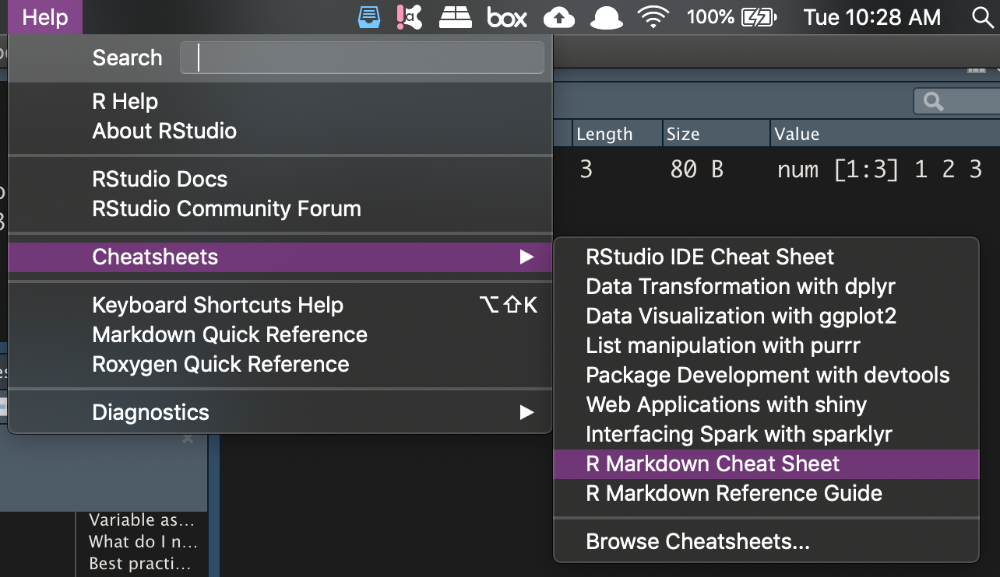

```{r setup, include=FALSE}
knitr::opts_chunk$set(echo = TRUE)
library(emo)
```

```{r include=FALSE}
# run this first
# pagedown::chrome_print("presentations/2_R-Rmd.html", output = "presentations/2_R-Rmd.pdf")
```


## Overview: Goals & exercises

- Learn the basics of the R programming language

> `r emo::ji("memo")` <span style="color:red"> 1. Create new R project </span>

> `r emo::ji("memo")` <span style="color:red"> 2-3. Create & edit helper.R </span>

- Learn the basics of Markdown writing

- Learn how to combine R code and markdown text to create RMarkdown documents

> `r emo::ji("memo")` <span style="color:red"> 4-6. Create, edit, and compile .Rmd file </span>


## Don't worry {-}

<center>
<blockquote class="twitter-tweet"><p lang="en" dir="ltr">The funniest thing about this is that the time scale could be one day or the past 5 years.</p>&mdash; C.B. Standelmore (@bankingonbardo) <a href="https://twitter.com/bankingonbardo/status/1202267486726410240?ref_src=twsrc%5Etfw">December 4, 2019</a></blockquote> <script async src="https://platform.twitter.com/widgets.js" charset="utf-8"></script>

<font size="3">
*p.s. [Allison Horst's R illustrations are amaaaazing](https://github.com/allisonhorst/stats-illustrations) and I will be using them throughout.*
</font>
</center>


<!-- ##  and  Recap -->

##
<center>

</center>

## 
### Recap: Console and script panes in RStudio {-}

<div class="columns-2">


<br>

- <span style="color:red"> Console: </span> Run code, see print outs, see warnings, messages, and errors

<br>

- <span style="color:blue"> Source: </span> Run code from a script. Multiple scripts can be open at once.

</div>


## What is "Markdown?"
<div class="columns-2">

<font size="2">[Hashify.me]()</font>


- Simple syntax that allows you to add tags to plain text to format it
- Originally designed to be HTML replacement
  - Easier to learn and easier to read
- "Minimalist writing system"
</div>

<br><br>

<font size="4">
<center>
[Lifehacker: What is markdown and why is it better for my to do lists and notes?](https://lifehacker.com/what-is-markdown-and-why-is-it-better-for-my-to-do-lis-5943320)
</center>
</font>

## What is R Markdown?
<div class="columns-2">
<center>

<font size="3">https://rmarkdown.rstudio.com/</font>
</center>

- Integrate R code directly into your writing using basic Markdown syntax
- Reference management integration
- Reproducibility
- Accessible learning curve

</div>

<br>

<center>
`r emo::ji("pencil2")` Very useful for writing summary reports, articles, etc.
</center>

## R Markdown


<font size="5"> 
We're going to make this today!
</font>


# Intro to 

## R Packages & Libraries
**Packages** are bundles of code written to do (typically) specific sets of functions

- Some packages are automatically downloaded and loaded into your workspace when you install R (`base`, `utils`, etc...) or R Studio (`rmarkdown`)
- Others you have to explicitly download
- Many packages are hosted on CRAN - this is the official "home" of peer-approved packages
  - These can be installed using the function `install.packages()`.

```{r eval=FALSE}
install.packages("tidyverse")
```

## R Packages & Libraries
### Non-CRAN packages

- Other packages are not hosted on CRAN - many of these are excellent, but some may be less reliable.
  - Many of these are hosted on GitHub.com 
  - These usually have to be installed using a function `install_github()` which is part of the `remotes` package.
  
```{r eval=FALSE}
# install.packages("remotes")
# This installs the "emo" package for easy emoji use
remotes::install_github("hadley/emo")
```


<!-- For example: To install the `emo` package from Hadley Wickham's Github page:  -->

<!-- - [https://github.com/hadley/emo]() -->

<!--  -->

## Libraries
- "Library": where your R packages live after install (automatic location)
- "Load packages" with `library()` function to *use* a package.

```{r message=TRUE}
# load the tidyverse package
# expect a bunch of output messages (this is normal)
library(tidyverse) 
```

<!-- - If you ask R to load a package you don't have installed, or make a typo in the package name, R will yell at you (give you an *error*): -->

<!-- ```{r message=TRUE, warning=TRUE, error=TRUE} -->
<!-- # Typo! what happens? R yells at you. -->
<!-- library(tidverse) -->
<!-- ``` -->


## What can you do with R code?
### Use it like a calculator
```{r echo=TRUE}
3 + 2
10^4
4*100
```

## What can you do with R code?
### Print information to the console

```{r echo=TRUE}
print("Hello!")
print(3*5)
```

## What can you do with R code?
### Create new objects

*Read the following as "x is equal to 5"*

```{r echo = TRUE}
x <- 5
```

*And we can now type x in the console to see its value*
```{r echo=TRUE}
x
```

x is now a **variable** that is set to the value of the number 5.

## Variables
**Variable**: a symbol that stores/represents some other *value* or set of values.

Think of variables as containers.

<center>

</center>


## Variable assignment
Variables get **assigned** their value in R with a left arrow `<-`

**Numeric variables** represent numbers
```{r}
x <- 5
```

This means the value of the variable we have named `x` is equal to 5.

**String variables** represent "strings" of text. Text has to be enclosed in quotes `""`

```{r}
my_var <- "hello"
```

This means the value of the variable `my_var` is equal to the text "hello".

## Variable assignment
Variables don't just hold numbers and text - they can hold sets of numbers/text, lists of various kinds of information, and whole data sets!

When you create a new variable in R, you will see it in your Environment pane.




## What do I name my variables?

## Best practices in naming your variables {-}
In R, it's pretty flexible. Not as flexible in other languages (*\*cough\* Praat \*cough\**)

*Some suggestions*

Try your best to...

- Be descriptive
- Be consistent in your content
- Be consistent in your case (camel/snake/etc)

*i_like_snake_case* but some people *likeCamelCase* and others may *like-kabob-case*,

## Variable names: Choose your case
<center>

<font size="3">
[https://github.com/allisonhorst/stats-illustrations]()
</font>
</center>

## Variable names: Not okay

**General rules:**

|    Not allowed     |                                         Why                                          |
| :---------------- | :---------------------------------------------------------------------------------- |
|        1abc        |                                 Starts with a number                                 |
|  intelligibility%  |                   Contains a special character like !@#$%^&*, etc.                   |
|      .1my_var      |                    Starts with a period followed by a number (.1                     |
|      _my_var       |                            Starts with an underscore (\_)                            |
| special characters | Some words have special meaning to R and you shouldn't overwrite them (e.g., "mean") |

## Variable names: Better

|                  Allowed |                      Good because |               Bad because |
| -----------------------: | --------------------------------: | ------------------------: |
|                        x |                  short, lowercase |            Not meaningful |
|   intelligibility_scores |      meaningful, easy to remember | Takes a long time to type |
|                 int_mean |                 meaningful, short |      `r emo::ji("shrug")` |
| int_mean_pd, int_mean_hc | meaningful, shortish, descriptive |                A bit long |


## Beware of typos!
```{r error=TRUE}
my_var <- 5

My_var
myVar
my_var
```

## Getting started: R Projects

[R Projects](https://support.rstudio.com/hc/en-us/articles/200526207-Using-Projects) make project management really simple. For every new project you embark on, creating a new .RProj file. 
Open that .RProj file whenver you're ready to work on that project, and it will: 

<div class="columns-2">

- Provide easy access to the directory
- Restore your last RStudio session from that project
- Provide access to your R history from your last session

<br>


</div>


## `r emo::ji("memo")` <span style="color:red"> Exercise 1 </span>
1. Create a new R Project for this group
2. Create a new R script: helper.R
3. Include the following lines:

```{r}
# Load libraries ----
# install.packages("tidyverse")
library(tidyverse)

x <- 5
y <- x*10
my_var <- "hello"

y
```

## `r emo::ji("memo")` <span style="color:red"> Exercise 2 </span>

Try running some code...
  
  - From the script (Cmd or Ctrl + Enter to run the line your cursor's on)
  - From the console (type code + hit enter)
  
Create some new variables
  
  - Run them in the script
  - Call them in the console

<!-- ### Numeric variables -->
<!-- In your console, do the following: -->

<!-- - Create a variable x and assign it a value of some number -->
<!-- - Create a variable of y and assign it a value of some other number -->
<!-- - Create some other variable (name it whatever you like!) and assign it a value of yet another number -->

<!-- ### String variables -->
<!-- In your console, do the following: -->

<!-- - Create a variable `a` and assign it a value of some text (don't forget to enclose the text in quotes!) -->
<!-- - Create a variable `b` and assign it a value of some other text -->
<!-- - Create a variable with another name and assign it yet another text value -->


## Types of objects in R
1. Numeric

```{r eval=FALSE}
1, 198758, 10^6, pi, abs(-6)
```


2. Strings: collection of characters, e.g...

```{r eval=FALSE}
"abc", "the rainbow is a division of white light", "12345", "$%^&"
```


3. Factors: categorical variables. Make up a finite set.

```{r eval=FALSE}
"Blue" "Green" "Red"
```

4. Logicals: special kind of factor that only has two values

```{r eval=FALSE}
TRUE vs FALSE, 0 vs 1
```

  
## Types of data structures

[Good explanation here](https://jamesmccaffrey.wordpress.com/2016/05/02/r-language-vectors-vs-arrays-vs-lists-vs-matrices-vs-data-frames/)

1. **Vectors**: collection of similar elements (numbers, characters, factors, etc..). 1 dimensional

```{r eval=FALSE}
# This vector contains 3 numeric components
c(1, 100, 1000)
```

2. Matrices: 2D arrangement of vectors
3. Lists: Can hold lots of different element types
4. Arrays: Vectors with 1 or more dimensions
5. **Data frames**: collections of vectors

> We will mostly use data frames. More on those in a minute...


## Comments
- In R scripts, any line of code preceded by a hashmark (#) is not *evaluated* (i.e., it's ignored)
- You can write notes to your future self this way
- To comment out a block of code, select it and type Cmd (or Ctrl) + Shift + C

```{r eval=FALSE}
# This line is a comment to myself.
# Set x equal to 0
x <- 0
# Now add 1 to the value of x
y <- x+1
```


## Functions
**Functions**: A certain named format of code that outlines a procedure. Often this allows several lines of code to be executed with a single line of code (by using the name of the function) 

- In other words, functions are **actions**. 
- Most functions take **arguments**
  - What do you want to act on?

## Calling functions

### function_name(argument1, argument2, ...)

- In R Studio, if you start typing the name of a function and hit tab, you will get a pop up with possible options. 
- Within the () of the function, pressing tab will help you add the arguments.



## Looking at data: A spreadsheet perspective

```{r echo=FALSE}
my_data <- read.csv("2_materials/simulated_vot_data.csv")
```

Most of us are used to looking at data in the form of a spreadsheet.

- Named columns with many rows
- Each row usually represents one observation

*See simulated_vot_data.csv*

## Looking at data: A spreadsheet perspective

### My usual workflow: 

- Collect data in spreadsheet.
- Load spreadsheet data into R as a **data frame**.
- Do all other data manipulation and analyses in R.
- Never touch the raw data again.

## Looking at data

<center>

</center>

## Looking at data
To access individual columns, use the `$` operator

```{r eval = FALSE}
my_data$Participant
```

To peak at the first 6 rows of the data, use the `head()` function

```{r}
head(my_data)
```


## Looking at data

We can also look at subsets of data

```{r}
subset(my_data, Condition=="Fast")
```


## Looking at data
### Using the pipe `%>%` to combine functions

```{r eval=FALSE}
my_data %>%
  first_do(args) %>%
  then_do(args)
```


```{r}
my_data %>%
  subset(Condition=="Fast") %>%
  head()
```


## Tidyverse: A word

>"The tidyverse is an opinionated collection of R packages designed for data science. All packages share an underlying design philosophy, grammar, and data structures."
[www.tidyverse.org]()

- Changed the game of R coding
- Much more intuitive syntax (IMHO); more "english-like"
- BUT not everyone likes it. Sometimes makes things easier, sometimes makes things more complicated.
- We'll be using both
- Core packages of the tidyverse: ggplot2, dplyr, tidyr, readr, stringr...

- <span style="color:red"> "The pipe is syntactic sugar" </span> - [Hadley Wickham]()

## `r emo::ji("memo")` <span style="color:red"> Exercise 3 </span>
1. Ensure `simulated_vot_data.csv` is saved in your R Project folder
2. Add and run the following code to your R script:

```{r eval=FALSE}
# Load data ----
vot <- read.csv("simulated_vot_data.csv")

# Explore data ----
head(vot) 
tail(vot)
str(vot) 
names(vot) 
summary(vot) 
nrow(vot) 
View(vot) 
```

## Rmarkdown
[](https://github.com/allisonhorst/stats-illustrations)
[RStudio's "What is R Markdown" Video](https://vimeo.com/178485416)

The goal of today's workshop is to establish a workflow for using the [`rmarkdown`](https://rmarkdown.rstudio.com/) package to "knit" together R code and text to create summary documents.


<!-- It might seem kind of odd to launch into a workflow that ties together R code *and other stuff* before we've actually had a chance to learn any R code, but here's the rationale: -->

<!-- 1. `r emo::ji("hammer_and_wrench")` **Foundational skill:** R Markdown document creations can serve as a way to document the rest of our skills. At each workshop, we'll create another R Markdown document (extension .`Rmd`) to log the skills we worked on and any notes you'd like to keep for yourself. In this way, this skill is *foundational*. -->
<!-- 2. `r emo::ji("raised_hands")` **Instant gratification!** R Markdown documents can be rendered without much working knowledge of R at all. It's a lovely thing when you can get something up and running RIGHT AWAY -->

## Essential parts of any R Markdown document


## Essential parts of any R Markdown document
For today, we will only bother learning to edit text and code chunks.

We'll learn about editing the YAML and chunk options another day.

# R Markdown: Text in Markdown syntax

## Markdown {-}
**Markdown**: set of conventions for editing plain text. 

Write as you normally would in a text editor or word processor, but you signal text formatting with certain characters (next slide).

Markdown (which is distinguished from *markUP* language) is designed to be 

- <span style="color:red">**easy to read**</span></span>
- <span style="color:red">**easy to write**</span>
- <span style="color:red">**easy to learn** </span>

## Markdown syntax


<!-- ``` -->
<!-- *italic* -->
<!-- **bold** -->
<!-- **italic and bold!*** -->

<!-- # First level header -->
<!-- ## Second level header -->
<!-- ## Third level header -->

<!-- 1. the first item on a numbered list -->
<!-- 2. the second item on a numbered list -->

<!-- - the first item on a bulleted list -->
<!-- - the second item on a bulleted list -->
<!--   - item 2a -->
<!-- ``` -->

## Markdown syntax

Tables written like this: 

```
First Header  | Second Header
------------- | -------------
Content Cell  | Content Cell
Content Cell  | Content Cell
```

- See [Tables Generator website](http://www.tablesgenerator.com/markdown_tables)
- *See `remedy` and `beautifyR` R packages/RStudio addins for dealing with markdown tables*
- Data frames can be turned into tables without manual modification
  - *See `kable` and `flextable` R packages*

# R Markdown: R code in code chunks

## Code chunks {-}

- [*Chunks*](http://yihui.name/knitr/options/) are sections that will include R code. By setting defaults at the beginning of your document, you can specify what you want most of your chunks to do.
- In each chunk, you can specify options in the form `tag=value` in the chunk header.
  - Example: `echo=TRUE`: code will print verbatim in the output.
  - **For now, don't worry about editing the header!**
- Within a chunk: regular R code!

<center>

</center>

## Code chunks

**Insert a new R chunk by**

- Typing `Alt + Cmd/Ctrl + i` OR
- Clicking `Code >> Insert Chunk` from the R Studio menu


## Inline R code
You can include R code as *inline R code*, embedded in to the text. 

<br>

<center>


<br>

The value of `mean(vot$VOT)` will print in the output.

</center>

## `r emo::ji("memo")` <span style="color:red"> Exercise 4 </span>
<center>
**Make a new R Markdown document!**


**Title it something useful**



**Save it in your project folder (01_c4s_rmd.Rmd)**
</center>

## `r emo::ji("memo")` <span style="color:red"> Exercise 5 </span>

1. Delete everything after Line 12.
2. Add a new header
3. Add some plain text
4. Add some **bold** text
5. Add a code chunk that includes 1x <- 5` and `x`
6. Compile! ("Knit"): Cmd/Ctrl + K or with Knit button

<center>

</center>

## `r emo::ji("memo")` <span style="color:red"> Exercise 6 </span>

- Copy the code from your `helper.R` script to your R Markdown document. 
- Compile again!
- Let's diagnose our errors!

**Note:** It is also possible to `source` an R script into an R Markdown document. This is much more helpful for manuscript writing... more on this another day!

## Getting unstuck
<div class="columns-2">
<span style="color:red"> **Googling errors as art form** </span>

- Google your errors!
- Google "how to use XX package in r"
- Search Twitter (#rstats)

<span style="color:red"> **Read the documentation** </span>

- Type `??function` in the console
- Google the package name online
- R Studio cheat sheets


</div>


## Schedule for the rest of the term
|  Date|  Time|  Location| Topic|
|--:|--:|--:|--:|
|  2/25|  4pm|  Cary Hall 42| Intro to group + RStudio|
|  3/10|  4pm|  Cary Hall 135| Intro to R + R Markdown|
|  3/24|  4pm|  Cary Hall 135| Cleaning + manipulating data|
|  4/7|  4pm|  Cary Hall 135| Data visualizations|
|  4/21|  4pm|  Cary Hall 135| Praat?|
|  5/5|  4pm|  Cary Hall 135| Praat?|


## Resources: Intro to R
- [RStudio's recommended beginner R links](https://education.rstudio.com/learn/beginner/): Lots of tutorials, suggestions, and cheat sheets!
- [R for Data Science](https://r4ds.had.co.nz/): THE book on learning R.
- [Teacup Giraffes](https://tinystats.github.io/teacups-giraffes-and-statistics/index.html): Intro modules to statistics with R
- ["R you with me?"](https://rladiessydney.org/courses/ryouwithme/): A series of online learning resources for beginner R users designed by [R-Ladies Sydney](https://rladiessydney.org/)

## Resources: RMarkdown
- [Intro to RMarkdown: Video](https://www.youtube.com/watch?v=0yAIeykkRhw&feature=youtu.be) (12 minutes)
- [RMarkdown: The definitive guide](https://bookdown.org/yihui/rmarkdown/)
- [R for data science: R Markdown](https://r4ds.had.co.nz/r-markdown.html)
- [RMarkdown reference guide from RStudio](https://rstudio.com/wp-content/uploads/2015/03/rmarkdown-reference.pdf)
- [RMarkdown Cheatsheet from RStudio](https://rstudio.com/wp-content/uploads/2015/03/rmarkdown-reference.pdf)


