```{r setup, include=FALSE}
knitr::opts_chunk$set(echo = TRUE)
library(emo)
```

```{r include=FALSE}
# run this first
# pagedown::chrome_print("rmd_rladies_coventry_presentation.html", output = "rmd_rladies_coventry_presentation.pdf")
```

##  {.unnumbered}

<center>


<font size="2"> *p.s. [Allison Horst's R illustrations are amaaaazing](https://github.com/allisonhorst/stats-illustrations) and I will be using them throughout.* </font>

</center>

<!-- [RStudio's "What is R Markdown" Video](https://vimeo.com/178485416) -->

## Overview

Learn how to use R Markdown to combine writing and code

> `r emo::ji("memo")` [ Create new R project ]{style="color:red"}

> `r emo::ji("memo")` [ Create, edit, and compile .Rmd file ]{style="color:red"}

> `r emo::ji("memo")` [ Create & edit helper.R file to feed to your .Rmd ]{style="color:red"}


##  {.unnumbered}

<center>

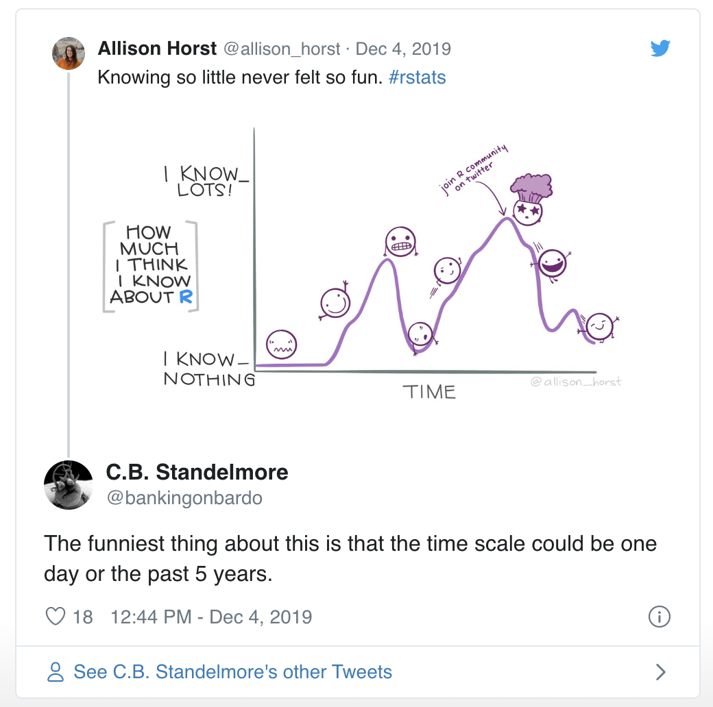

</center>

## 

<center>

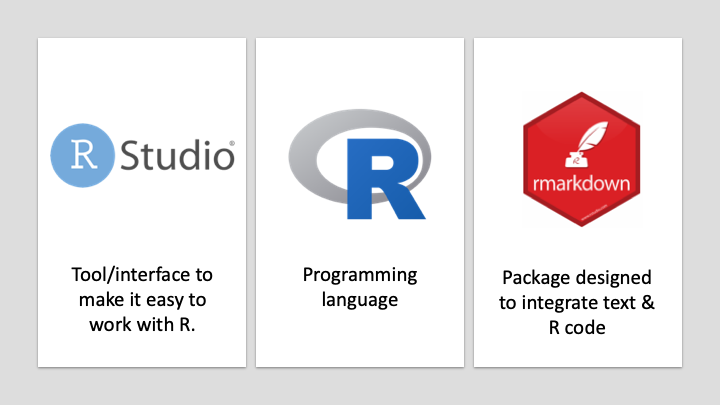

</center>

## 

### Recap: Console and script panes in RStudio {.unnumbered}

::: {.columns-2}
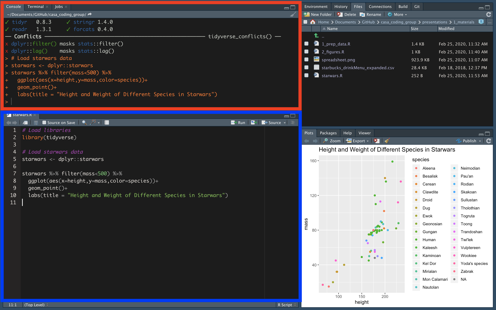

<br>

-   [ Console: ]{style="color:red"} Run code, see print outs, see warnings, messages, and errors

<br>

-   [ Source: ]{style="color:blue"} Run code from a script. Multiple scripts can be open at once.
:::

## What is "Markdown?"

::: {.columns-2}
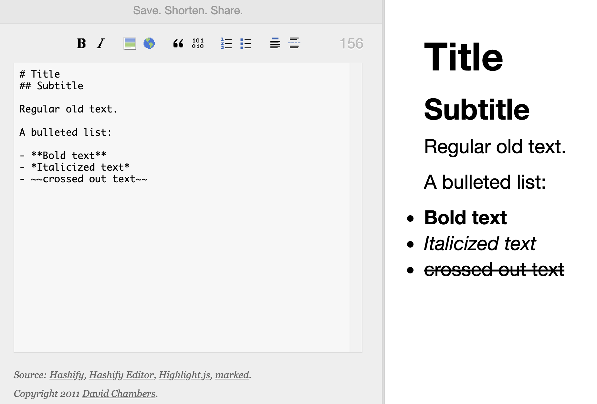 <font size="2">[Hashify.me]()</font>

-   Simple syntax that allows you to add tags to plain text to format it

-   Originally designed to be HTML replacement

    -   Easier to learn and easier to read

-   "Minimalist writing system"
:::

<br><br>

<font size="4">

<center>

[Lifehacker: What is markdown and why is it better for my to do lists and notes?](https://lifehacker.com/what-is-markdown-and-why-is-it-better-for-my-to-do-lis-5943320)

</center>

</font>

## What is R Markdown?

::: {.columns-2}
<center>

 <font size="3"><https://rmarkdown.rstudio.com/></font>

</center>

-   Integrate R code directly into your writing using basic Markdown syntax
-   Reference management integration
-   Reproducibility
-   Accessible learning curve
:::

<br>

<center>

`r emo::ji("pencil2")` Very useful for writing summary reports, articles, etc.

</center>

## R Markdown | We're going to make this today!

<center>
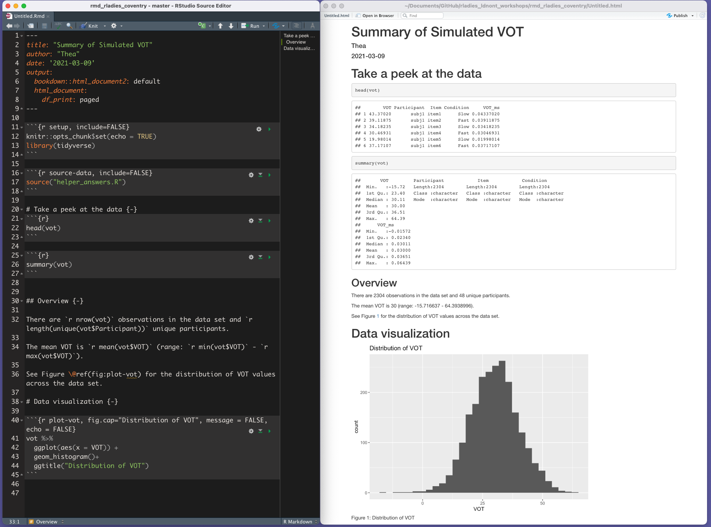
</center>

# Part 1 | The basics

## `r emo::ji("memo")` <span style="color:red"> Exercise 1 </span> | Create a new R Project

::: {.columns-2}
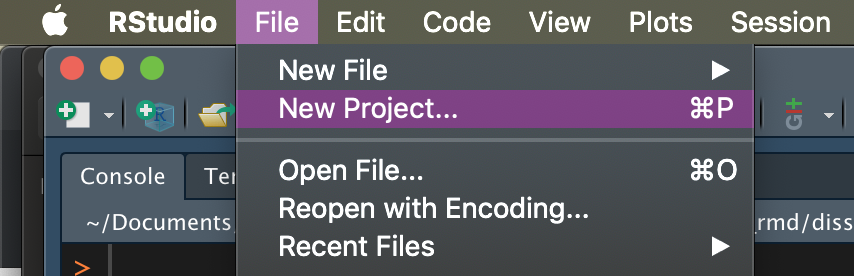

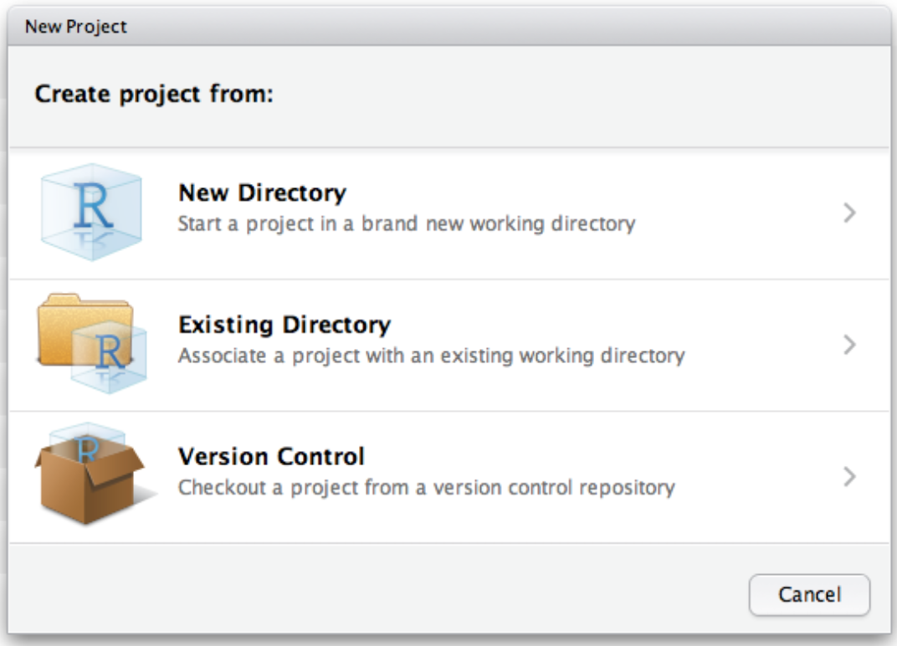

1. Make a new directory for this workshop
2. Put the workshop contents in the same directory

:::

<center>
<font size = 3>

- *You can restore where you left off by opening the .RProj file again later.*
- [More on RProjects](https://r4ds.had.co.nz/workflow-projects.html)

</font>
</center>


## `r emo::ji("memo")` <span style="color:red"> Exercise 2 </span> | Create a new R Markdown document

::: {.columns-2}

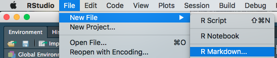

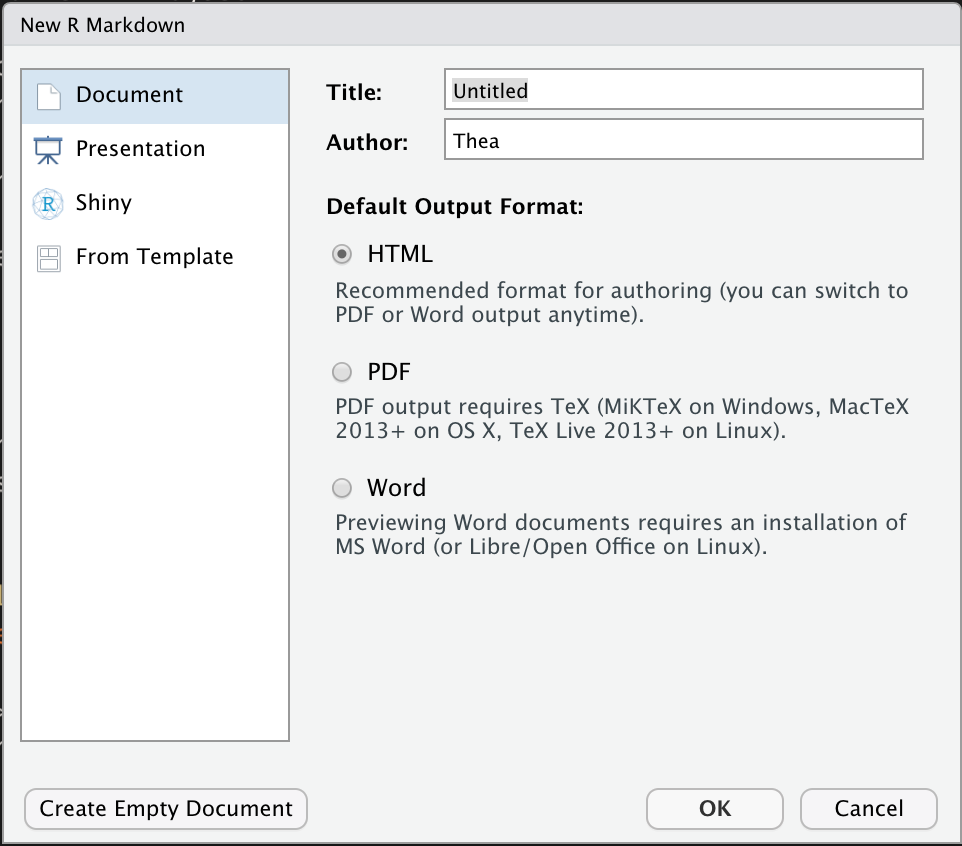

1. Create a new R Markdown file
2. Title it something useful
3. Save it in the project folder you just made
4. Compile! ("Knit"): Cmd/Ctrl + K or with Knit button

<center>

</center>
:::


# Essential parts of any R Markdown document

## Essential parts of any R Markdown document


## YAML

[YAML](https://en.wikipedia.org/wiki/YAML) (rhymes with camel): The header that tells R Markdown how to generate your document. Indentation and spacing are very important.

-   Permits the following to happen when you knit:

    -   .Rmd -\> knitr -\> .md -\> Pandoc -\> output
    -   Output can be .docx, .html, .pdf, and many others

-   YAML: "YAML Ain't Markup Language"

## YAML

**Basic:**

```{r eval = FALSE}
title: "Untitled"
author: "Thea Knowles"
date: '2018-02-18'
output: word_document
```

## YAML

**More options...**

```{r eval = FALSE}
title: "Changes in voice acoustics along a speech rate continuum
        in Parkinson's disease"
author: "Thea Knowles, Scott G. Adams, Mandar Jog"
date: Last updated `r Sys.Date()`
output:
  bookdown::word_document2:
    reference_docx: "../rmd_templates/custom_reference.docx"
  redoc::redoc:
    highlight_outputs: FALSE
    margins: 1
    line_numbers: FALSE
bibliography: references.bib
csl: "csl_files/apa7.csl"
```

## YAML

::: {.columns-2}
**Even more options...**

-   templates for Word, PDF, etc.
-   bibliography file
-   **csl** (references style guide)
-   **css** (supreme customization!)
-   journal articles, slides, websites

**Different options for:**

-   [HTML output](https://rmarkdown.rstudio.com/html_document_format.html)
-   [Word output](https://rmarkdown.rstudio.com/word_document_format.html)
-   [PDF output](https://rmarkdown.rstudio.com/pdf_document_format.html)

*Note: We will just learn about HTML output today*
:::

## Essential parts of any R Markdown document


## Code chunks

-   [*Chunks*](http://yihui.name/knitr/options/) are sections that will include R code. By setting defaults at the beginning of your document, you can specify what you want most of your chunks to do.

-   In each chunk, you can specify options in the form `tag=value` in the chunk header.

    -   For example, in the following, the tag `include` is set to `FALSE`, indicating that we don't want the contents of this chunk included in the output

## Code chunks
- Let's say we want to include a code chunk that assigns x the value of 10.
- Here are some ways we can do that.

## Code chunks

**First, insert a new R chunk by**

- Typing `Alt + Cmd/Ctrl + i` OR
- Clicking `Code >> Insert Chunk` from the R Studio menu

## Code chunks
### Bare R code chunk (no labels or options)

````markdown
`r ''````{r}
x <- 10
```
`````

## Code chunks
### Give it a **label** ("my-chunk")

````markdown
`r ''````{r my-chunk}
x <- 10
```
````
    
*`r emo::ji("warning")` Chunk labels CANNOT contain spaces, underscores, or special characters, but CAN contain hyphens.*

## Code chunks
### Tell RMarkdown what to do with it (Set **chunk options**)

````markdown
`r ''````{r my-chunk, echo = FALSE}
x <- 10
```
````

In this example, we set the `echo` option:

- `echo = TRUE`: show the code in the rendered Rmd document
- `echo = FALSE`: don't show the code in the output, but DO run it in the background

## Code chunks: More options

[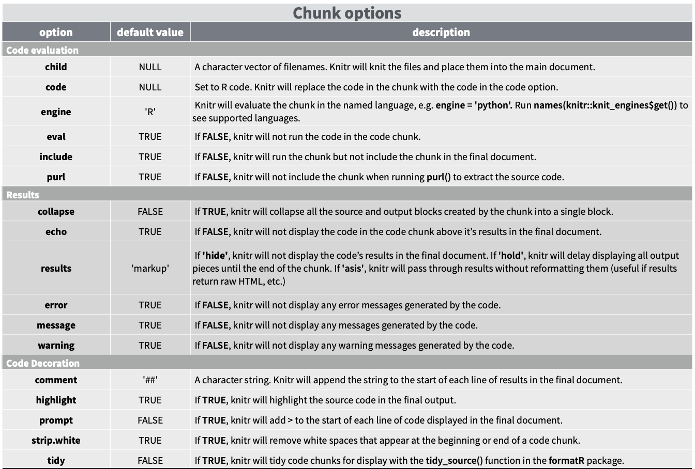](https://rstudio.com/wp-content/uploads/2015/03/rmarkdown-reference.pdf)

## Code chunks: More options

> `r emo::ji("right_arrow")`[RMarkdown cheat sheet](https://rstudio.com/wp-content/uploads/2015/03/rmarkdown-reference.pdf)

> `r emo::ji("right_arrow")`[RStudio lesson](https://rmarkdown.rstudio.com/lesson-3.html)

> `r emo::ji("right_arrow")`[Knitr book chapter](https://yihui.org/knitr/options/)

## Code chunks: Special setup code chunk

Let's say you want to set default behavior for all of your code chunks. You can do this using the `knitr` package in a special chunk at the beginning of your document. 

When you create a new Rmarkdown document from the default template, this is included for you:

````markdown
`r ''````{r setup, include=FALSE}
    knitr::opts_chunk$set(echo = TRUE)
```
````

## Code chunks: Special setup code chunk

````markdown
`r ''````{r setup, include=FALSE}
    knitr::opts_chunk$set(echo = TRUE)
`r ''````
````

This chunk provides the following information for "knitting" the document:

-   **setup**: the name of the chunk You shouldn't have two chunks with the same name, unless they are unnamed (in which case they just get numbered automatically during the knit process)
-   **include = false**: the chunk will not be included in the output after knitting.
-   **knitr::opts_chunk$set(echo = TRUE)**: set `echo = TRUE` for all chunks (you can still set `echo = FALSE` in individual chunks later if you want)


## Essential parts of any R Markdown document


# R Markdown | Text in Markdown syntax

## Markdown {.unnumbered}

**Markdown**: set of conventions for editing plain text.

Write as you normally would in a text editor or word processor, but you signal text formatting with certain characters (next slide).

Markdown (which is distinguished from *markUP* language) is designed to be

-   [**easy to read**]{style="color:red"}</span>
-   [**easy to write**]{style="color:red"}
-   [**easy to learn** ]{style="color:red"}

## Markdown syntax

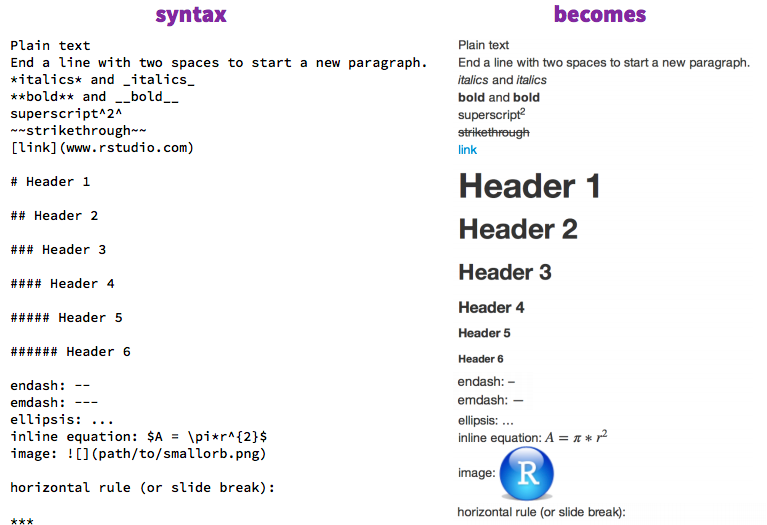


## Markdown syntax

Tables written like this:

    First Header  | Second Header
    ------------- | -------------
    Content Cell  | Content Cell
    Content Cell  | Content Cell

-   See [Tables Generator website](http://www.tablesgenerator.com/markdown_tables)

-   *See `remedy` and `beautifyR` R packages/RStudio addins for dealing with markdown tables*

-   Data frames can be turned into tables without manual modification

    -   *See `kable` and `flextable` R packages*

## Inline R code
You can refer to variables stored in R in your code using the syntax:
  `` `r
      [r code here!]` ``
      
### Example:
Earlier in your code you have assigned `x <- 5` in an R chunk

```{r}
x <- 5
```

Typing 

<span style="color:red">
<center>
The value of x is
      `` `r
      x` `` 

</span>
</center>

<span style="color:grey">
will print
</span>


<span style="color:red">
<center>
The value of x is `r x`
</center>
</span>


## `r emo::ji("memo")` <span style="color:red"> Exercise 3 </span> | Customize
In the Rmarkdown document you created from the default template...

<font size = 4>

1. Delete everything after Line 12 (after the setup code chunk)
2. Add a new header
3. Add some plain text
4. Add some **bold** text
5. Add a code chunk that includes `x <- 5` and `x`
6. Include a line that says:


      The value of x is
      `` `r
      x` `` 


7. Compile! ("Knit"): Cmd/Ctrl + K or with Knit button.

</font>


# Part 2 | Scaling up to real-world use

## My habits
- do my data cleaning/exploration in a separate .R script ("helper.R")
- *source* my `helper.R` file in my RMarkdown document and use code chunks to polish figures/tables
- include in-line R code that refers back to R objects made in helper.R


## `r emo::ji("memo")` <span style="color:red"> Exercise 4 </span> | Create `helper.R`

First: make sure `simulated_vot_data.csv` is in your project folder (same level as the .RProject). Then:

1. Create a new .R script 
2. Add the following code
3. Save it as `helper.R` in your project folder (same level as your .RProject for now)

```{r eval = FALSE, include=FALSE}
vot <- read.csv("simulated_vot_data.csv")
vot_m <- mean(vot$VOT)
```

Try to run the code in the R console.

`r emo::ji("bug")` We can pause to diagnose any errors people run into!

## `r emo::ji("memo")` <span style="color:red"> Exercise 5 </span> | Source & use the code in `helper.R` in your RMarkdown document

Open your .Rmd file and insert a new code chunk below the setup chunk


````markdown
`r ''````{r source-helper}
    source("helper.R")
    
    min(vot$VOT)
    max(vot$VOT)
`r ''````
````

Knit the .Rmd document. What do you see?

`r emo::ji("bug")` We can pause to diagnose any errors people run into!


## `r emo::ji("memo")` <span style="color:red"> Exercise 6 </span> | Add in-line R code

Below your R chunk, add the following lines:


The mean VOT is
`` `r
vot_m` ``.

The mean VOT is
`` `r
min(vot$VOT)` `` 
and the max VOT is
`` `r
max(vot$VOT)` ``.


## `r emo::ji("memo")` <span style="color:red"> Exercise 7 </span> | Add a plot

Add another code chunk:

````markdown
`r ''````{r vot-distribution}
    hist(vot$VOT)
`r ''````
````

## Exponentially useful
The ability to refer to your code in your document becomes EXTREMELY helpful once you start creating multiple figures, reporting summary variables and tables of statistics

<br>
<center>
`r emo::ji("world_map")` *Tour of some of the ways I use RMarkdown*

<font size = 4>

- Manuscripts
- Dissertation
- Presentations like this one that needs to show/demonstrate code
- Summary documents to supervisor/colleagues/stats consults
- "Trapper-keeper" for large projects
- My websites

</font>

</center>

## Manuscript draft

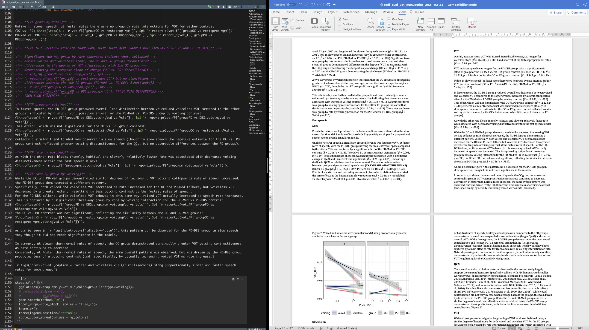

## Dissertation record keeping

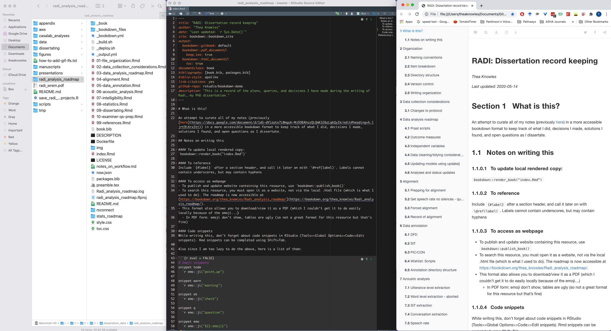

##  {.unnumbered}

<center>


</center>

## Build your skills gradually
Build your skill set to tailor to your goals: Some guiding suggestions based on my own experience

  - Start with using R Markdown to tell the story of your data to you, to your supervisor (summary reports)
  - If dissertating - start early! Use RMarkdown as a way to keep track of your data. Compile frequently and read up on project management
  - Write an article in RMarkdown & learn how to use templates, reference management integration, and .RData files
  - Present your data using RMarkdown
    - This presentation uses the `ioslides_presentation` output, but [`xaringan`](https://bookdown.org/yihui/rmarkdown/xaringan.html) is an extremely powerful & popular tool for RMarkdown presentations
    
## R Studio Visual R Markdown `r emo::ji("fire")`
- RStudio v1.4 released a mode to edit markdown more easily - the result is a word processor-style experience
- I still recommend getting the basics down first, but this is an exciting development

[Read more about Visual R Markdown Editing Mode here](https://rstudio.github.io/visual-markdown-editing/#/)

# More resources

## More resources
- [R Markdown: The Definitive Guide](https://bookdown.org/yihui/rmarkdown/)
- [R Markdown Cookbook](https://bookdown.org/yihui/rmarkdown-cookbook/)
- [R-Ladies #LdnOnt guide to dissertating with R Markdown and bookdown](https://bookdown.org/thea_knowles/dissertating_rmd_presentation/)
- [Page Piccinini's R for Publication Lessons](https://datascienceplus.com/r-for-publication-by-page-piccinini-lesson-1-r-basics/)
- [A curated/quasirandom list of other very helpful resources](https://www.one-tab.com/page/d00HO6mxTTuqo2o7aGCffQ)

## And even more resources
here are some of the additional "extras" we talked about

- [More on snippets](https://bookdown.org/thea_knowles/dissertating_rmd_presentation/nitty-gritty-stuff.html#snippets): Autocomplete text shortcuts for common strings of text.
- [RData vs. RDS](https://rstudio-education.github.io/hopr/dataio.html): Load in your environment or specific R objects for faster rendering
- [tjmisc::ggpreview()](https://github.com/tjmahr/tjmisc): preview your plots before knitting
- [RMarkdown: notebooks vs. documents](https://bookdown.org/yihui/rmarkdown/notebook.html): Notebooks allow a special execution mode of R Markdown that allows you to see the results of your chunks in the Source pane as you go. All .Rmd files can be rendered as notebooks and vice versa.


# Thank you!!!
